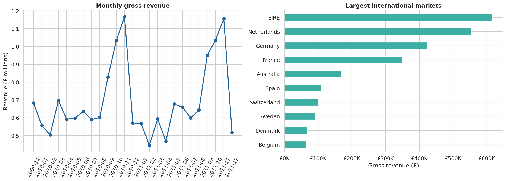
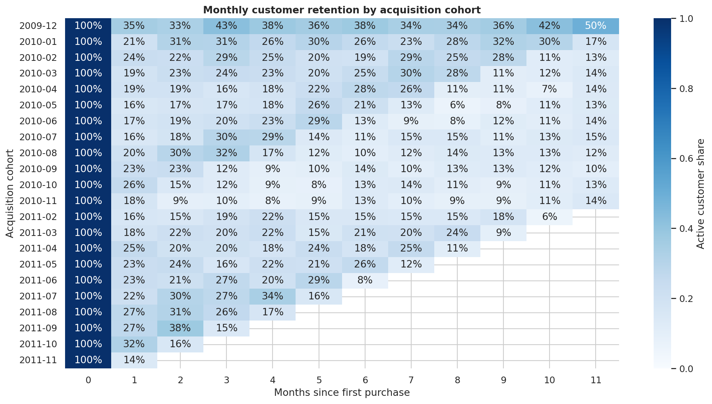
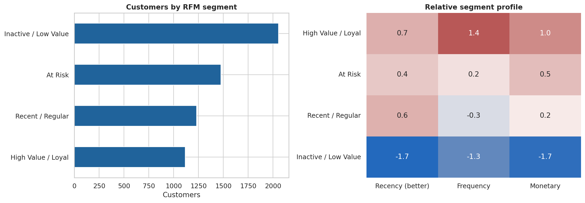
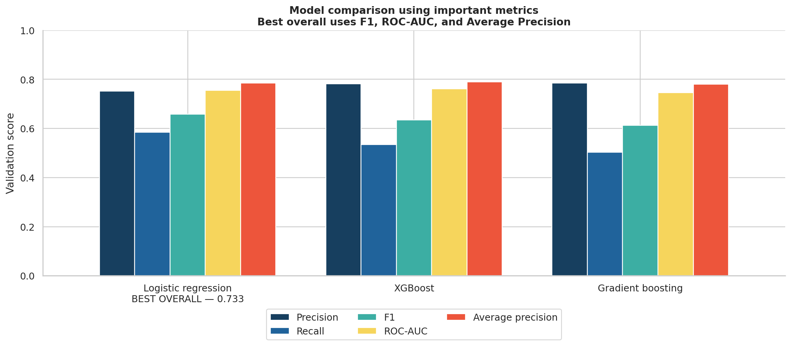
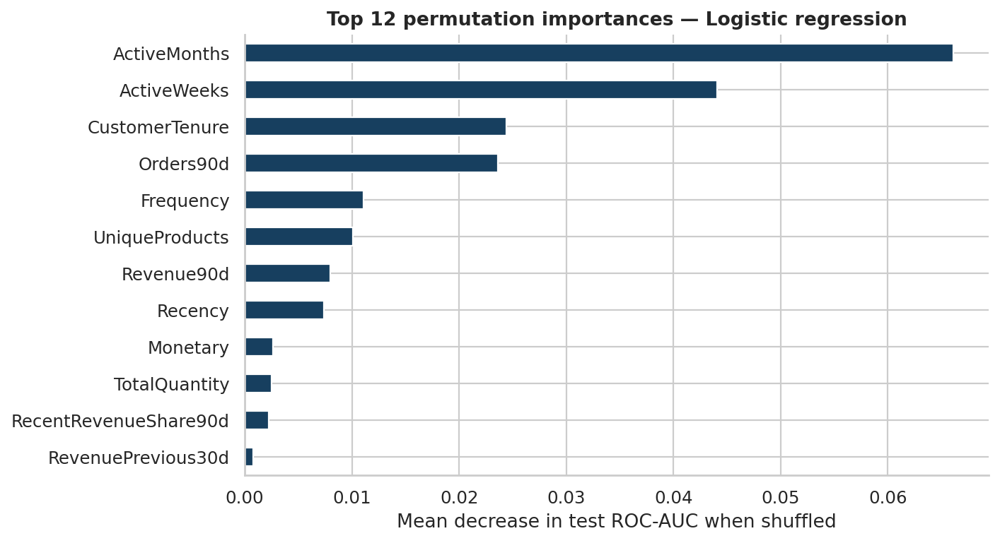

# Online Retail Customer Analysis
Customer segmentation and repeat-purchase prediction using RFM, K-Means, and machine learning.

## Project Overview
This project uses two years of transaction data from a UK online store to explore how customers shop and whether they come back. I cleaned the data, looked at sales and customer trends, grouped customers by shopping behavior, and built a model to predict who might buy again in the next 90 days.

## Main Question
Can past shopping behavior help us understand customer groups and predict who will buy again in the next 90 days?

## Dataset
I used the [Online Retail II dataset from UCI](https://archive.ics.uci.edu/dataset/502/online%2Bretail%2Bii). It has 1,067,371 rows of sales data from a UK online store, covering December 2009 to December 2011. Each row represents one product on an invoice, so one order can have several rows.

## Data Cleaning
The raw data included duplicate rows, missing customer IDs, returns, cancelled orders, and invalid prices. I removed duplicate rows and kept purchases with a customer ID, a positive quantity, and a positive price. I kept returns and cancellations separate because this analysis focuses on customer purchases.
After cleaning, 779,425 of the original 1,067,371 rows remained as valid purchases. About 22.8% of the raw rows had no customer ID, so they could not be used to study individual customers.

## Sales and Customer Trends
The cleaned data includes 36,969 orders from 5,878 customers, with £17,374,804 in gross purchase revenue. The median order value was £303, and 72.4% of customers placed more than one order.
Most of the gross purchase revenue (82.8%) came from the United Kingdom. There were also sales peaks at the end of the year, indicating seasonal trends.

## Customer Retention
I grouped customers by the month of their first purchase and checked how many bought again in later months. The chart shows how customer activity changes over the first 12 months.

In the RFM analysis, I looked at three measures for each customer: Recency, Frequency, and Monetary value. I then used K-Means to divide customers into four groups based on their buying activity: High Value / Loyal, Recent / Regular, At Risk, and Inactive / Low Value.

The chart on the left shows the number of customers in each group. The heatmap on the right compares the groups using their median recency, number of orders, and total amount spent. Recency was reversed so that a higher score means a more recent purchase. The median values were then transformed and standardized across the four groups.

**How to read the heatmap:** Red means a more recent purchase, more orders, or more spending, depending on the column. Blue means the opposite. Red generally shows stronger buying activity, but each color describes only one measure, not the whole customer group. Each number shows how a group compares with the average of the four groups in that column, after the values were transformed. Zero is the average. Positive numbers are above the average, and negative numbers are below it. For example, 0.7 is slightly above the average, while −1.7 is further below it. The distance from the average is measured in standard deviations.
The table below the chart shows the actual median days since the last purchase, number of orders, and total amount spent for each group.

| Segment | Customers | Median days since last purchase | Median orders | Median total spending |
|---|---:|---:|---:|---:|
| High Value / Loyal | 1,117 | 15 | 13 | £5,231.8 |
| At Risk | 1,474 | 162 | 5 | £1,587.2 |
| Recent / Regular | 1,231 | 23 | 3 | £720.9 |
| Inactive / Low Value | 2,056 | 400 | 1 | £290.7 |

## Repeat-Purchase Prediction
I used each customer's activity from the previous 180 days to predict whether they would buy again in the next 90 days. To keep the test realistic, I trained the models on earlier dates, used a later period for validation, and saved the most recent period for the final test.

### Model Results
I included a majority baseline that predicted no repeat purchase for every customer. I then compared logistic regression, XGBoost, and gradient boosting using validation data. Accuracy was not the only thing I focused on because it would not indicate how good my model is at predicting repeat buyers. I used logistic regression based on the average of its F1 score, ROC-AUC, and Average Precision.

On the final test data, logistic regression reached 0.737 ROC-AUC, 0.740 F1, and 78% recall. The majority baseline had 0 F1.

### Feature Importance

To see which features were important to the model, I randomly shuffled each feature one at a time and measured how much the test ROC-AUC score decreased. The most influential feature was ActiveMonths, which measures the number of months a customer made a purchase in the past 180 days.

## Business Takeaways

Segmenting customers and using the predictive model helps the retailer determine who should be targeted. In other words, the retailer could direct its win-back strategy toward valuable customers who are likely to become attritors. Of course, any win-back strategy must be measured in terms of a control group, since just because something is predicted does not mean it was caused by the strategy.

## Limitations
Many transactions had no customer ID, so I could not use them for customer-level analysis. Returns were kept separate but were not matched to their original purchases. The data also does not include campaign costs or profit, so I cannot tell whether a suggested offer would be worth its cost.

## How to Run
Open `Online_Retail_Customer_Analytics.ipynb` in Google Colab and run the cells from top to bottom. The notebook downloads the dataset automatically if it is not already available.
